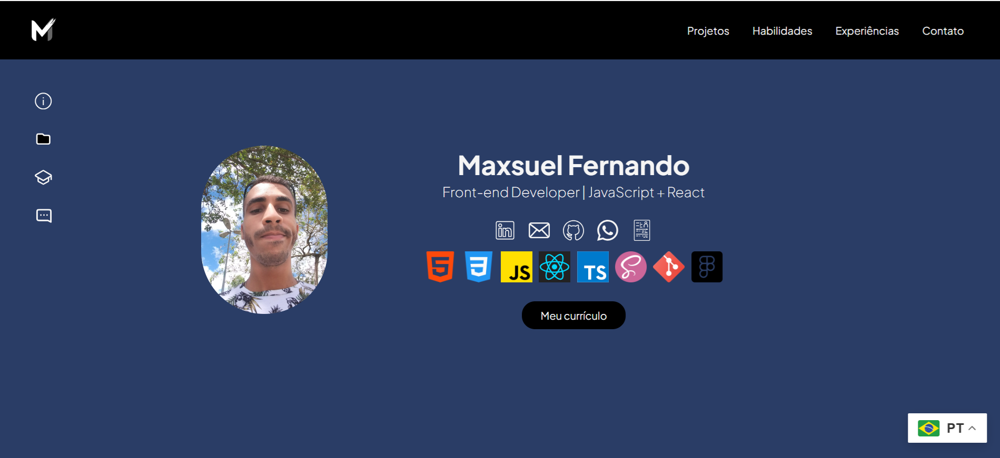

# Portfólio de Desenvolvedor Front-End | React




> Sou desenvolvedor front-end com foco em criar interfaces rápidas e responsivas usando React. Neste portfólio, compartilho alguns dos meus projetos. Trabalho com boas práticas de usabilidade e performance, sempre buscando oferecer uma experiência de usuário de qualidade.

<br>

## 📋 Pré-requisitos

[NodeJS](https://nodejs.org/pt) - Ambiente de execução JavaScript no lado do servidor, que permite criar aplicações rápidas e escaláveis

<br>

## 🛠️ Construído com
* [React](https://pt-br.react.dev/) - Biblioteca JavaScript para construção de interfaces de usuário interativas e dinâmicas;
* [Styled-Components](https://styled-components.com/) - Biblioteca para estilização de componentes em React usando CSS dentro de JavaScript;
* [Axios](https://axios-http.com/ptbr/docs/intro) - Biblioteca JavaScript para fazer requisições HTTP, simplificando a comunicação com APIs;
* [SwiperJS](https://swiperjs.com/) - Biblioteca para criar sliders e carrosséis responsivos e touch-friendly em sites e aplicativos;
* [React Icons](https://react-icons.github.io/react-icons/) - Biblioteca que oferece ícones personalizáveis para projetos em React, facilitando a integração de ícones vetoriais.
<br>


## ⚙️ Executando o projeto

```
git clone https://github.com/maxsueldev/portfolio-website.git
```

* Abra a raiz do projeto e execute: 

```
npm install
```

* E em seguida: 

```
npm run dev
```

<br>

## JSON Server API
* https://json-server-max.vercel.app/projects


